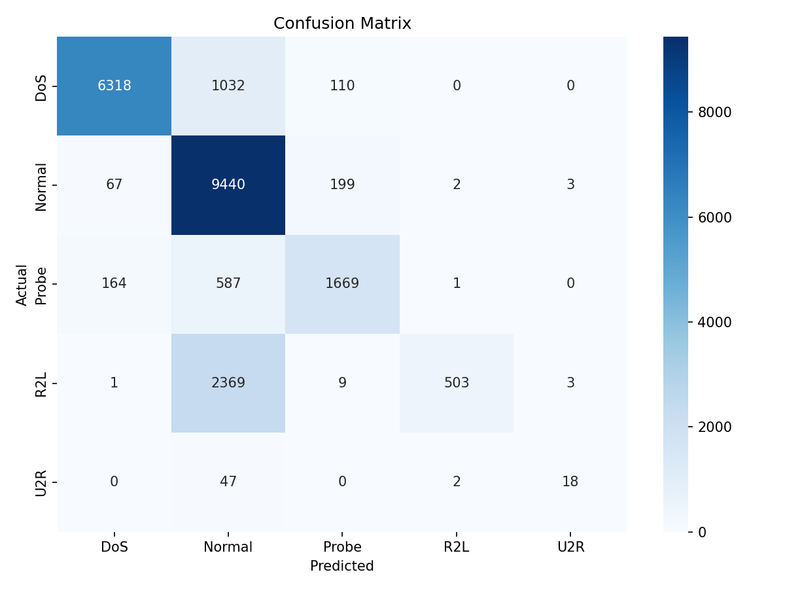

# Network Intrusion Detection — Assignment Report

**Course:** Advanced Python (ICS0019)
**Team members:** Kaan Metin, Lorenz Ritsch
**Date:** 25.05.2026
---

## 1. Approach

### 1.1 Strategy Overview

We had no fixed plan before starting. Our initial goal was simply to reproduce
the baseline and understand why it is not good enough. After observing that
the baseline Random Forest almost completely ignores R2L and U2R attacks, we
focused all effort on improving detection of those two minority classes, as
they were the main reason for the low macro F1 score.

Our general approach:

1. Establish a baseline, try out Random Forest
2. Deal with class imbalance
3. Switch to XGBoost
4. Engineer features

### 1.2 Preprocessing

Beyond the starter code, we applied the following:

- **Feature engineering:**
  - Replaced label encoding of `protocol_type`, `service`, and `flag` with
    one-hot encoding. Label encoding implies a spurious ordinal relationship
    (e.g. `http=22 > ftp=10`) that does not exist. One-hot encoding gives
    XGBoost a separate binary column per category, which is more expressive
    particularly for the `service` feature (~70 unique values) that is highly
    informative for R2L attack detection.
  - Applied `log1p` transformation to seven heavily right-skewed numeric
    features: `duration`, `src_bytes`, `dst_bytes`, `count`, `srv_count`,
    `dst_host_count`, `dst_host_srv_count`. These span several orders of
    magnitude; log-scaling compresses the long tail and makes tree splits
    more informative.
  - Added three derived features: `bytes_ratio` (src_bytes / dst_bytes + 1),
    `error_rate_avg` (mean of serror_rate and rerror_rate), and
    `srv_error_rate_avg` (mean of srv_serror_rate and srv_rerror_rate).
  - Final feature count: **124** (up from 40).

- **Feature selection:** Dropped `num_outbound_cmds` (constant zero throughout
  the dataset, as specified in the assignment). No further features were removed.

- **Scaling:** No scaling applied. Tree-based models (Random Forest, XGBoost)
  are invariant to feature scale.

- **Other:** Categorical features (`protocol_type`, `service`, `flag`) were
  initially label-encoded using the starter code. The one-hot encoding step
  replaced this encoding in our final pipeline.

### 1.3 Class Imbalance Handling

As the training set is severely unbalanced, we addressed this with SMOTE
(Synthetic Minority Over-sampling Technique).

- **Method:** SMOTE with default `sampling_strategy='auto'`, which upsamples
  all minority classes to match the majority class size (~67,000 each).
- **Parameters:** `k_neighbors=5` (default), `random_state=42`.
- **Effect:** Training set expanded from 125,973 to ~336,000 rows. Post-SMOTE
  class distribution: all five classes balanced at ~67,000 samples.
- **Implementation:** SMOTE was always applied inside an `ImbPipeline` (from
  `imbalanced-learn`) so that it fires only on the training fold during
  cross-validation and never sees the validation or test data.

We also tested `class_weight='balanced'` on Random Forest (Experiment 2) and
SMOTETomek with custom sampling targets (Experiment 4). Both performed worse
than plain SMOTE.

---

## 2. Experiments

### Experiment 1: Random Forest baseline

- **Algorithm:** RandomForestClassifier, default parameters
- **What changed from starter code:** Nothing — this is our own baseline run
- **Macro F1 (CV):** not formally computed
- **Macro F1 (test):** 0.5009
- **Observation:** The model performs well on DoS (F1=0.87) and Normal
  (F1=0.78) but is essentially blind to R2L (F1=0.02, recall=0.01) and weak
  on U2R (F1=0.11, recall=0.06). This confirms the class imbalance problem —
  the model learned that predicting "Normal" is almost always safe.

### Experiment 2: Random Forest with balanced class weights

- **Algorithm:** RandomForestClassifier, `class_weight='balanced'`
- **What changed:** Added `class_weight='balanced'`
- **Macro F1 (CV):** not formally computed
- **Macro F1 (test):** 0.4779
- **Observation:** Counterintuitively, performance regressed. R2L F1 dropped
  from 0.02 to 0.00.

### Experiment 3: Random Forest with SMOTE

- **Algorithm:** RandomForestClassifier, default parameters, SMOTE applied
  before training
- **What changed:** Added SMOTE oversampling
- **Macro F1 (CV):** not computed
- **Macro F1 (test):** 0.5351
- **Observation:** Meaningful improvement over both previous experiments.
  R2L F1 jumped from 0.02 to 0.15.

### Experiment 4: SMOTETomek with custom sampling targets

- **Algorithm:** XGBoost, SMOTETomek with R2L=10,000, U2R=2,000, Probe=20,000
- **What changed:** Replaced SMOTE with SMOTETomek; reduced oversampling
  targets to avoid over-synthesising from few originals
- **Macro F1 (CV):** not computed
- **Macro F1 (test):** 0.5900
- **Observation:** Worse than plain SMOTE. Capping U2R at 2,000 synthetic
  examples gave the model too little variation to learn from.

### Experiment 5: XGBoost + SMOTE + feature engineering (best result)

- **Algorithm:** XGBoost (tuned parameters), SMOTE, one-hot encoding,
  log transforms, ratio features
- **What changed:** Feature engineering applied before training (see
  Section 1.2)
- **Macro F1 (CV):** 0.9438
- **Macro F1 (test):** 0.6331
- **Observation:** New best result. DoS F1 improved substantially
  (0.88 → 0.90) due to log transforms on byte counts. R2L F1 improved
  (0.24 → 0.30) due to one-hot encoding of `service`, which separates
  services associated with R2L attacks (ftp, imap, telnet) from unrelated
  ones. Probe F1 dropped slightly (0.81 → 0.76) — the reason is unclear but
  may relate to probe attacks being spread across many service types,
  making one-hot encoding less helpful there.

### Experiments Summary

| # | Description | Algorithm | Imbalance Handling | Macro F1 (CV) | Macro F1 (test) |
|---|---|---|---|---|---|
| 1 | Baseline | Random Forest | None | — | 0.50 |
| 2 | Balanced class weights | Random Forest | `class_weight='balanced'` | — | 0.48 |
| 3 | SMOTE oversampling | Random Forest | SMOTE | — | 0.54 |
| 4 | SMOTETomek custom targets | XGBoost | SMOTETomek | — | 0.59 |
| 5 | Feature engineering | XGBoost | SMOTE in ImbPipeline | 0.9438 | 0.6331 |

---

## 3. Final Results

### 3.1 Best Model

- **Algorithm:** XGBoost (XGBClassifier) inside ImbPipeline with SMOTE
- **Key parameters:**
  - `n_estimators=406`
  - `max_depth=6`
  - `learning_rate=0.165`
  - `subsample=0.828`
  - `colsample_bytree=0.868`
  - `min_child_weight=1`
  - `tree_method='hist'` (fast approximate splitting)
  - `eval_metric='mlogloss'`
- **Imbalance handling:** SMOTE (`k_neighbors=5`, `random_state=42`) inside
  ImbPipeline — applied per CV fold, never to validation/test data
- **Feature engineering:** One-hot encoding of `protocol_type`, `service`,
  `flag`; log1p transforms on 7 skewed numerics; 3 ratio features;
  total 124 features

### 3.2 Final Macro F1-Score

| Metric | Score |
|---|---|
| **Macro F1 (test)** | **0.6331** |
| Macro F1 (CV) | 0.9438 |

### 3.3 Classification Report

| Category | Precision | Recall | F1-Score | Support |
|---|---|---|---|---|
| Normal | 0.70 | 0.97 | 0.81 | 9,711 |
| DoS | 0.96 | 0.85 | 0.90 | 7,460 |
| Probe | 0.84 | 0.69 | 0.76 | 2,421 |
| R2L | 0.99 | 0.17 | 0.30 | 2,885 |
| U2R | 0.75 | 0.27 | 0.40 | 67 |
| **Macro avg** | **0.85** | **0.59** | **0.63** | **22,544** |

### 3.4 Confusion Matrix

---

## 4. Cross-Validation vs. Test Score

- **CV macro F1:** 0.9438
- **Test macro F1:** 0.6331
- **Gap:** 0.31

**Analysis:** The gap is large but expected, as KDDTest+ contains attack
types that do not appear in KDDTrain+.

During cross-validation, all folds are drawn from KDDTrain+. When a fold is
held out for validation, its R2L examples are of the same attack types as
the training folds (warezclient, guess_passwd, ftp_write, imap, etc.). The
model learns these patterns well, producing a high CV score.

In KDDTest+, R2L contains attack types such as `httptunnel`, `sendmail`, and
`named` — none of which appear in training. The model's internal
representation of "what R2L looks like" does not match these new patterns,
so R2L recall drops from ~0.95 (CV) to 0.17 (test). The same applies to U2R.

---

## 5. What Worked and What Didn't

### What had the biggest positive impact

1. **Switching from Random Forest to XGBoost** (+0.10 macro F1, from 0.53
   to 0.63). XGBoost builds trees sequentially, with each tree correcting
   the errors of the previous ones. This error-correction mechanism is
   particularly effective for rare classes: later trees in the sequence
   focus specifically on the residual errors, which are predominantly R2L
   and U2R misclassifications.

2. **SMOTE oversampling** (+0.03 macro F1 on Random Forest, from 0.50 to
   0.53; contributed to all subsequent results). SMOTE generated synthetic
   minority examples that gave the model sufficient variation to learn R2L
   and U2R patterns, rather than always defaulting to Normal.

3. **Feature engineering** (+0.006 on best XGBoost model, from 0.627 to
   0.633). One-hot encoding `service` was the most impactful change: it
   allowed the model to learn that specific services (ftp, imap, telnet)
   are associated with R2L attacks, rather than treating service as an
   ordinal integer. Log-transforming byte counts improved DoS detection
   (F1: 0.88 → 0.90).

### What surprisingly didn't help

1. **`class_weight='balanced'` on Random Forest** actually regressed
   (0.50 → 0.48). Upweighting the 52 U2R training examples by ~1,300×
   caused the model to overfit to those specific U2R patterns, which did
   not match the unseen U2R attacks in the test set.

2. **SMOTETomek with conservative sampling targets** hurt vs. plain SMOTE
   (0.59 vs 0.63). Setting U2R=2,000 was too conservative: the model needed
   more variation than 2,000 interpolations of 52 originals could provide.

### What would you try with more time

- Stacking ensemble
- Deeper domain-specific feature engineering
- Soft voting

---

## Appendix: Environment

- **Hardware:** Intel Core i5-1235U, 16 GB RAM
- **Python version:** 3.13.7
- **Key libraries:**
  - scikit-learn
  - xgboost
  - lightgbm
  - imbalanced-learn
  - pandas
  - numpy
- **Random seed:** 42
